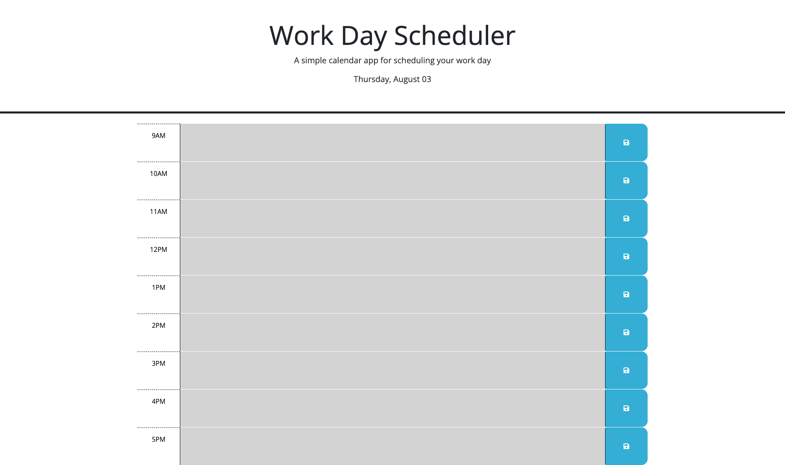

# Work Day Scheduler

## Description

Provide a short description explaining the what, why, and how of your project. Use the following questions as a guide:

- Used js to modify static HTML
- Stores inputs from user in localstorage and displays upon opening
- Helps keep track of your time by showing you your past, current, and upcoming objectives for the specific hour

## Installation

N/A

## Usage

To use webpage, simply type any objectives into the input field and click the save button, values will be saved and you will be able ot keep track of your progress throughout the day!

## Credits

- Dylan Stoudt
- uPenn

## License

MIT license provided in repo

---

🏆 The previous sections are the bare minimum, and your project will ultimately determine the content of this document. You might also want to consider adding the following sections.

## Badges

Badges aren't necessary, but they demonstrate street cred. Badges let other developers know that you know what you're doing. Check out the badges hosted by [shields.io](https://shields.io/). You may not understand what they all represent now, but you will in time.

## Features

If your project has a lot of features, list them here.

## How to Contribute

If you created an application or package and would like other developers to contribute to it, you can include guidelines for how to do so. The [Contributor Covenant](https://www.contributor-covenant.org/) is an industry standard, but you can always write your own if you'd prefer.

## Tests

Go the extra mile and write tests for your application. Then provide examples on how to run them here.

## Screenshot and link to deployed application
https://dylanstoudt.github.io/work-day-scheduler

